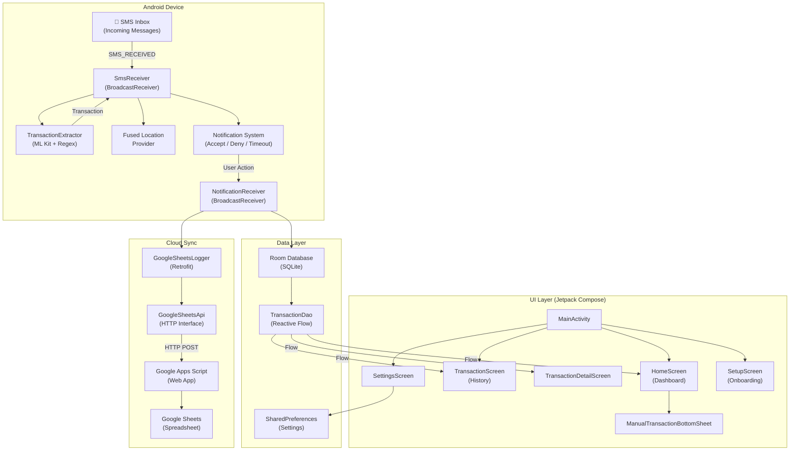
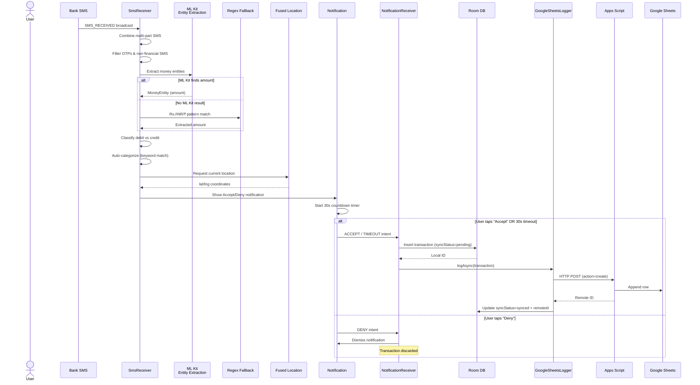
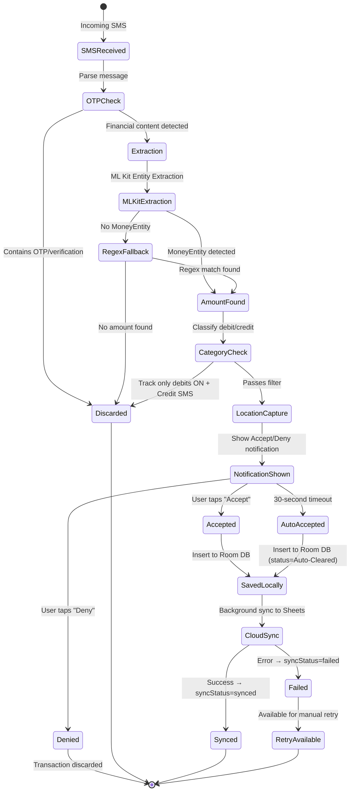
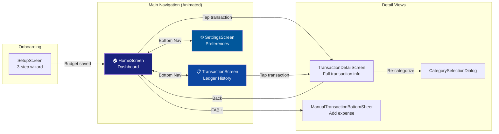
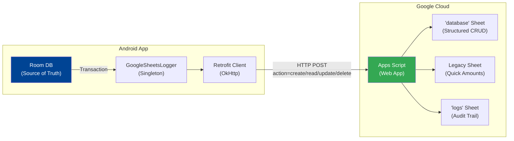
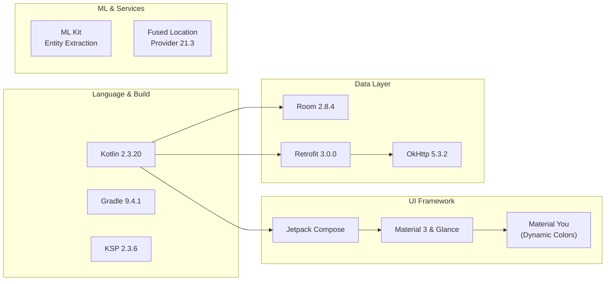

<p align="center">
  
</p>

<h1 align="center">Expense Tracker</h1>

<p align="center">
  <b>AI-Powered Automatic Expense Tracking for Android</b><br/>
  <i>SMS-based transaction detection with ML Kit, real-time notifications, geo-tagged spending, and cloud sync to Google Sheets</i>
</p>

<p align="center">
  
  
  
  
  
  
</p>

---

## Table of Contents

- [Overview](#overview)
- [Key Features](#key-features)
- [Architecture](#architecture)
  - [High-Level Architecture](#high-level-architecture)
  - [Data Flow — SMS to Cloud](#data-flow--sms-to-cloud)
  - [Notification & User Decision Flow](#notification--user-decision-flow)
  - [Directory Structure](#directory-structure)
- [Screens & Navigation](#screens--navigation)
- [Transaction Extraction Pipeline](#transaction-extraction-pipeline)
  - [ML Kit Entity Extraction](#ml-kit-entity-extraction)
  - [Regex Fallback](#regex-fallback)
  - [Category Classification](#category-classification)
- [Cloud Sync — Google Sheets](#cloud-sync--google-sheets)
  - [Sync Architecture](#sync-architecture)
  - [Apps Script Backend](#apps-script-backend)
  - [API Operations](#api-operations)
- [Data Model](#data-model)
- [Getting Started](#getting-started)
  - [Prerequisites](#prerequisites)
  - [Build & Run](#build--run)
  - [Permissions](#permissions)
  - [Setting Up Cloud Sync](#setting-up-cloud-sync)
- [Tech Stack](#tech-stack)

---

## Overview

**Expense Tracker** is a native Android application that **automatically detects financial transactions from incoming SMS messages** using Google ML Kit's Entity Extraction API. When a bank SMS arrives, the app extracts the amount, determines if it's a debit or credit, classifies it into a spending category, captures the user's GPS location, and presents an actionable notification — all in real-time, without any manual input.

Transactions are persisted locally in a Room database and optionally synced to **Google Sheets** via Apps Script for cloud backup, cross-device access, and spreadsheet-based analytics.

The UI is built entirely with **Jetpack Compose** and **Material 3**, featuring a premium financial dashboard with animated navigation, gradient balance cards, and a dark/light theme system.

---

## Key Features

| Feature                           | Description                                                                                                             |
|-----------------------------------|-------------------------------------------------------------------------------------------------------------------------|
| 📱 **Automatic SMS Detection**    | BroadcastReceiver intercepts incoming SMS and extracts transactions in real-time                                        |
| 💬 **RCS Bank Intercept**         | NotificationListenerService captures modern RCS bank transactions directly from system notifications                    |
| 🤖 **ML Kit Extraction**          | Google ML Kit Entity Extraction identifies monetary amounts; regex fallback                                             |
| 🧩 **Glance App Widget**          | Expressive Material 3 dynamic color widget allowing single-tap tracking from your homescreen                            |
| 🏷️ **Smart Categorization**      | Keyword-based classification across 7 categories (Dining, Transport, Groceries, Shopping, Bills, Entertainment, Health) |
| 📍 **Geo-Tagged Transactions**    | Captures precise GPS coordinates at time of transaction using Fused Location Provider                                   |
| 🔔 **30-Second Accept/Deny**      | Rich notification with Accept/Deny actions; auto-accepts on timeout                                                     |
| ☁️ **Google Sheets Cloud Sync**   | Full CRUD sync via Google Apps Script with duplicate prevention and API key auth                                        |
| ✏️ **Manual Logging**             | Bottom sheet for manually entering expenses with location capture                                                       |
| 💰 **Budget Tracking**            | Monthly budget target with remaining balance displayed on home card                                                     |
| 🌙 **Premium Dark/Light Themes**  | Material You dynamic colors + custom dark/light color schemes                                                           |
| 📊 **Financial Dashboard**        | Balance card with gradient design, recent activity feed, and transaction history grouped by date                        |
| 🧠 **AI Smart Sync (Lazy Sync)**  | On-device AI (Gemma 2B) scans historical SMS Inbox to retrieve older missed transactions                                |
| 🛡️ **Reliable Tracking**         | Persistent Foreground Service & Boot Receiver ensure the app never goes to sleep silently                               |
| 🔄 **Offline-First Architecture** | Local Room DB as source of truth; background cloud sync with retry for failed uploads                                   |
| 📤 **Transaction Sharing**        | Screenshot capture + text share of transaction details including Google Maps link                                       |

---

## Architecture

### High-Level Architecture



### Data Flow — SMS to Cloud



### Notification & User Decision Flow



### Directory Structure

```
ExpenseTracker/
├── app/
│   ├── build.gradle.kts                    # App-level Gradle config (dependencies, SDK versions)
│   ├── proguard-rules.pro                  # ProGuard/R8 rules
│   └── src/
│       └── main/
│           ├── AndroidManifest.xml          # Permissions, receivers, activity, FileProvider
│           ├── res/                         # Resources (layouts, drawables, strings, themes)
│           └── java/com/myapp/expensetracker/
│               │
│               ├── ── Core ──
│               ├── MainActivity.kt          # Entry point, permission handling, theme, navigation
│               ├── Transaction.kt           # Room @Entity — data model with 12 fields
│               ├── TransactionDao.kt        # Room @Dao — queries, inserts, sync status updates
│               ├── AppDatabase.kt           # Room database singleton (version 6)
│               │
│               ├── ── SMS Processing & AI ──
│               ├── SmsReceiver.kt           # BroadcastReceiver — SMS interception + notification
│               ├── SmsMonitorService.kt     # Foreground Service — Keeps app alive for reliable intercepts
│               ├── BootReceiver.kt          # BroadcastReceiver — Auto-starts monitor after device reboot
│               ├── LazySyncManager.kt       # Runs Gemma on-device model to extract transactions from history
│               ├── TransactionExtractor.kt  # ML Kit + Regex extraction pipeline
│               ├── NotificationReceiver.kt  # Handles Accept/Deny/Timeout notification actions
│               │
│               ├── ── Cloud Sync ──
│               ├── GoogleSheetsLogger.kt    # Retrofit-based CRUD client for Apps Script
│               ├── GoogleSheetsApi.kt       # Retrofit API interface + response models
│               │
│               └── ui/
│                   ├── ── Theme ──
│                   ├── theme/
│                   │   └── Theme.kt         # Material 3 color schemes, typography, theme composable
│                   │
│                   ├── ── Screens ──
│                   ├── screens/
│                   │   ├── HomeScreen.kt             # Financial dashboard + balance card + recent list
│                   │   ├── TransactionScreen.kt      # Full transaction history grouped by date
│                   │   ├── TransactionDetailScreen.kt # Detail view + re-categorize + delete + share + map
│                   │   ├── SettingsScreen.kt          # Budget, cloud sync, appearance, data management
│                   │   └── SetupScreen.kt             # 3-step onboarding wizard
│                   │
│                   └── ── Components & Widgets ──
│                       ├── components/
│                       │   ├── TransactionListItem.kt        # Reusable transaction row with sync indicators
│                       │   ├── ManualTransactionBottomSheet.kt # Manual expense entry bottom sheet
│                       │   └── CategoryUtils.kt               # Category → icon/color mapping
│                       └── ExpenseWidget.kt                  # Material 3 Glance homescreen widget
│
├── build.gradle.kts                         # Project-level Gradle config
├── settings.gradle.kts                      # Project settings (name, module includes)
├── gradle/
│   └── libs.versions.toml                   # Version catalog (Kotlin 2.1.10, Compose BOM, Room, etc.)
├── gradle.properties                        # Gradle JVM and Android settings
├── gradlew / gradlew.bat                    # Gradle wrapper scripts
└── .gitignore
```

---

## Screens & Navigation



| Screen | Description |
|--------|-------------|
| **SetupScreen** | 3-step onboarding: Welcome → Set monthly budget → Feature highlights |
| **HomeScreen** | Premium gradient balance card, monthly budget tracker, recent activity feed, FAB for manual logging, cloud sync status indicator |
| **TransactionScreen** | Full transaction history grouped by date (Today, Yesterday, dated headers) with animated list items |
| **TransactionDetailScreen** | Detailed view with category icon, amount display, date, merchant source, original SMS body, GPS coordinates, Google Maps link, re-categorize, delete, and share actions |
| **SettingsScreen** | Budget planning, Google Sheets cloud sync configuration (with embedded Apps Script code), appearance toggles (dark mode, system theme, debit-only tracking), data management |

---

## Transaction Extraction Pipeline

### ML Kit Entity Extraction

The primary extraction uses **Google ML Kit's Entity Extraction API** with the `ENGLISH` language model:

1. Downloads the ML model on first use (cached for subsequent extractions)
2. Annotates the SMS body for `Entity.TYPE_MONEY` entities
3. Extracts `MoneyEntity.integerPart` and `MoneyEntity.fractionalPart`
4. Skips amounts preceded by "bal" or "balance" (account balance, not transaction)

### Regex Fallback

If ML Kit fails to extract an amount, regex patterns are applied:

| Pattern | Example Match |
|---------|---------------|
| `Rs\.?\s*(\d+(?:,\d+)*(?:\.\d{1,2})?)` | `Rs. 1,500.00`, `Rs 250` |
| `INR\s*(\d+(?:,\d+)*(?:\.\d{1,2})?)` | `INR 3,200` |
| `₹\s*(\d+(?:,\d+)*(?:\.\d{1,2})?)` | `₹ 499.50` |
| `debited by\s*(\d+(?:,\d+)*(?:\.\d{1,2})?)` | `debited by 1500` |

### Category Classification

Transactions are classified via keyword matching against the SMS body:

| Category | Keywords |
|----------|----------|
| 🍔 **Dining** | Starbucks, Coffee, Restaurant, Zomato, Swiggy, McDonalds, KFC, Burger, Pizza, Cafe, Bake |
| 🚗 **Transport** | Uber, Ola, Taxi, Fuel, Petrol, Shell, Metro, IRCTC, Railway, Bus, Rapido |
| 🛒 **Groceries** | Market, Grocery, Foods, BigBasket, Blinkit, Zepto, Reliance, Fresh, Vegetable, Milk |
| 🛍️ **Shopping** | Shopping, Mall, Store, Amazon, Flipkart, Myntra, Ajio, Fashion, Clothing, Electronics |
| 💡 **Bills** | Bill, Utility, Electricity, Water, Gas, Recharge, Mobile, Internet, Broadband, Insurance, Premium |
| 🎬 **Entertainment** | Netflix, Hotstar, Spotify, Movie, Cinema, Theater, Prime, Gaming, Ticket |
| 🏥 **Health** | Pharmacy, Hospital, Clinic, Medical, Apollo, Doctor, Gym, Fitness |
| 💳 **Other** | Default fallback category |

### Debit/Credit Detection

| Type | Keywords |
|------|----------|
| **Debit** (negative) | debited, spent, paid, transferred, payment, sent, withdrawal, purchased, txn, using, done, deducted |
| **Credit** (positive) | credited, received, deposited, added, refunded, cashback |

---

## Cloud Sync — Google Sheets

### Sync Architecture



### Apps Script Backend

The app generates a complete **Google Apps Script** dynamically (with the user's Sheet ID embedded) that provides:

- **CRUD Operations**: Create, Read, Update, Soft/Hard Delete
- **Duplicate Prevention**: Strict millisecond-timestamp + amount matching
- **API Key Authentication**: Script Property-based security
- **Audit Logging**: All operations logged to a dedicated `logs` sheet
- **Concurrency Control**: `LockService` for write operations
- **Legacy Mode**: Writes debit amounts to a specific column for simple tracking

### API Operations

| Action | Method | Description |
|--------|--------|-------------|
| `create` | POST | Insert new transaction with duplicate check; returns `remoteId` |
| `read` | POST | Fetch all records or single record by ID |
| `update` | POST | Update amount, category, or status by `remoteId` |
| `delete` | POST | Soft delete (status → "deleted") or hard delete (row removal) |

### Sync States

| State | Icon | Description |
|-------|------|-------------|
| `pending` | ⏳ Spinning | Upload in progress |
| `synced` | ☁️ ✅ | Successfully synced with remote ID |
| `failed` | ☁️ ❌ | Upload failed; available for manual retry from home screen |

---

## Data Model

### Transaction Entity (Room)

```kotlin
@Entity(tableName = "transactions")
data class Transaction(
    @PrimaryKey(autoGenerate = true) val id: Int = 0,
    val remoteId: String? = null,        // Google Sheets row ID (e.g., "REC-1712345678901-123")
    val syncStatus: String = "synced",   // "pending" | "synced" | "failed"
    val sender: String,                  // SMS sender or merchant name
    val amount: Double,                  // Negative = debit, Positive = credit
    val date: Long,                      // Epoch milliseconds (SMS timestamp)
    val body: String,                    // Original SMS body or manual notes
    val category: String = "Other",      // Auto-classified category
    val status: String = "Cleared",      // "Cleared" | "Auto-Cleared" | "deleted"
    val type: String = "automated",      // "automated" (SMS) | "manual" (user entry)
    val latitude: Double? = null,        // GPS latitude at transaction time
    val longitude: Double? = null        // GPS longitude at transaction time
)
```

### Database Operations (DAO)

| Operation | Method | Return |
|-----------|--------|--------|
| Get all transactions | `getAllTransactions()` | `Flow<List<Transaction>>` |
| Get by ID | `getTransactionById(id)` | `Flow<Transaction?>` |
| Get by ID (suspend) | `getTransactionSync(id)` | `Transaction?` |
| Insert/Update | `insert(transaction)` | — |
| Insert & get ID | `insertAndReturnId(transaction)` | `Long` |
| Update sync status | `updateSyncStatus(id, remoteId, status)` | — |
| Delete single | `delete(transaction)` | — |
| Delete all | `deleteAllTransactions()` | — |
| Reset pending → failed | `resetPendingStatus()` | — |

---

## Getting Started

### Prerequisites

- **Android Studio** Ladybug or later
- **JDK 17** (configured in Gradle)
- **Android SDK 36** (compile SDK)
- **Physical Android device** with SMS capability (emulators won't receive real SMS)
- **Min SDK 33** (Android 13+)

### Build & Run

```bash
# 1. Clone the repository
git clone <repo-url> && cd ExpenseTracker

# 2. Open in Android Studio
#    File → Open → Select the ExpenseTracker directory

# 3. Sync Gradle
#    Android Studio will auto-sync. If not: File → Sync Project with Gradle Files

# 4. Connect a physical device with USB debugging enabled

# 5. Run the app
#    Click ▶️ Run or: ./gradlew installDebug
```

### Permissions

The app requests the following permissions at startup:

| Permission | Purpose |
|------------|---------|
| `RECEIVE_SMS` | Intercept incoming SMS for transaction detection |
| `READ_SMS` | Read SMS content for extraction |
| `POST_NOTIFICATIONS` | Show Accept/Deny transaction notifications |
| `ACCESS_FINE_LOCATION` | Capture precise GPS coordinates |
| `ACCESS_COARSE_LOCATION` | Fallback location access |
| `ACCESS_BACKGROUND_LOCATION` | Capture location even when app is in background |
| `INTERNET` | Cloud sync to Google Sheets and downloading AI models |
| `SCHEDULE_EXACT_ALARM` | 30-second auto-accept timeout alarm |
| `FOREGROUND_SERVICE` | Keeps the SMS monitoring process alive |
| `FOREGROUND_SERVICE_SPECIAL_USE` | Android 14+ requirement for the specific foreground process |
| `RECEIVE_BOOT_COMPLETED` | Automatically restarts SMS monitor upon phone reboot |

> **Note**: For location geo-tagging to work when the app is not in the foreground, grant **"Allow all the time"** location permission in Android Settings → Apps → Expense Tracker → Permissions → Location.

### Setting Up Cloud Sync

1. **Create a Google Sheet** and copy its URL
2. Open the app → **Settings** → **Cloud Sync (Google Sheets)** → Expand
3. Paste your **Google Sheet URL**
4. The app auto-generates the **Apps Script code** with your Sheet ID embedded
5. Copy the code → go to your Sheet → **Extensions → Apps Script** → Paste & Save
6. In Apps Script → **Project Settings** (⚙️) → **Script Properties** → Add: `API_KEY` = `your-secret-key`
7. **Deploy** → New Deployment → Web App → Access: "Anyone" → Copy the Web App URL
8. Back in the app, paste your **API Key** and **Web App URL** → Save

---

## Tech Stack



| Layer                     | Technology                       | Version        | Purpose                                                  |
|---------------------------|----------------------------------|----------------|----------------------------------------------------------|
| **Language**              | Kotlin                           | 2.3.20         | Primary language                                         |
| **Build**                 | AGP / Gradle                     | 9.1.1 / 9.4.1  | Build system                                             |
| **UI Framework**          | Jetpack Compose + Material 3     | BOM 2026.03.01 | Declarative UI with Material You theming                 |
| **Widgets**               | Glance App Widget                | 1.1.1          | Expressive dynamic Android homescreen widget             |
| **Local Database**        | Room                             | 2.8.4          | SQLite abstraction with reactive `Flow` queries          |
| **GenAI**                 | MediaPipe GenAI                  | LlmInference   | Runs Gemma 2B model on-device for historical "Lazy Sync" |
| **ML / AI**               | Google ML Kit Entity Extraction  | 16.0.0-beta6   | SMS money extraction                                     |
| **ML / NLP**              | Google ML Kit Language ID        | 17.0.6         | Language identification                                  |
| **Location**              | Google Play Services Location    | 21.3.0         | Fused Location Provider for geo-tagging                  |
| **HTTP Client**           | Retrofit + OkHttp                | 2.9.0 / 4.12.0 | Google Sheets API communication                          |
| **Serialization**         | Gson                             | via Retrofit   | JSON parsing for Sheets API responses                    |
| **Coroutines**            | Kotlinx Coroutines Play Services | 1.10.2         | `await()` for Play Services Tasks                        |
| **Annotation Processing** | KSP                              | 2.1.10-1.0.29  | Room annotation processing                               |

---

<p align="center">
  <b>Built with ❤️ for effortless financial tracking</b><br/>
  <i>Your spending, captured automatically — one SMS at a time.</i>
</p>
