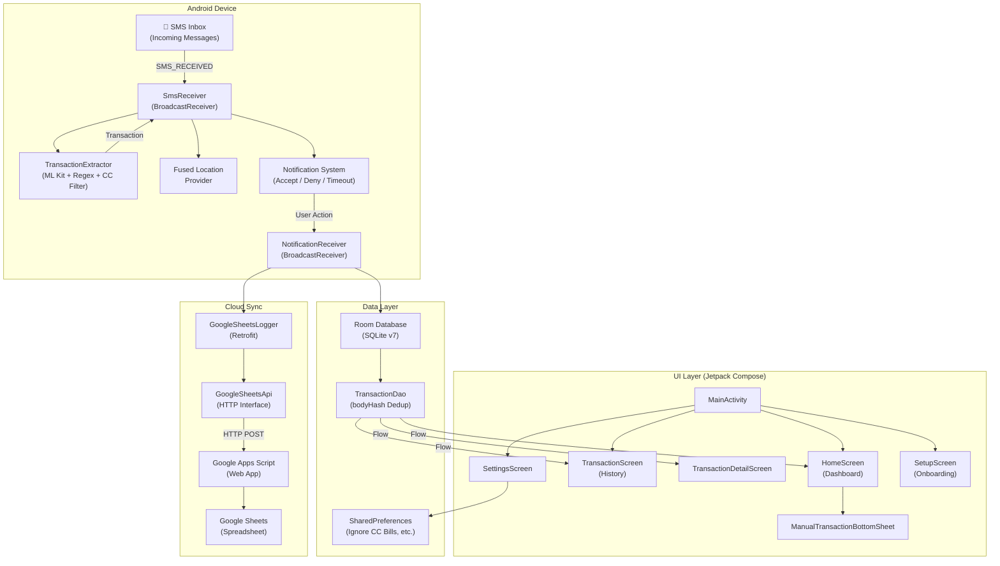
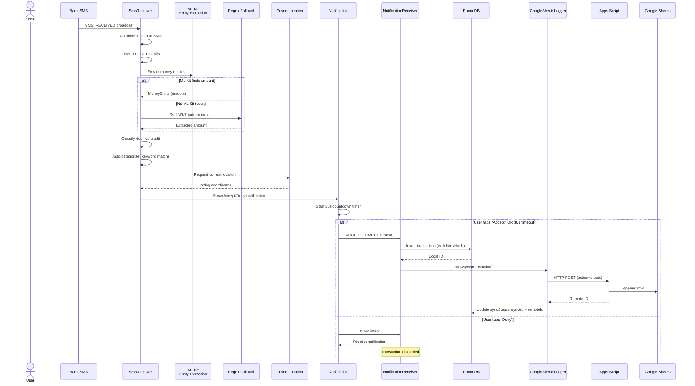
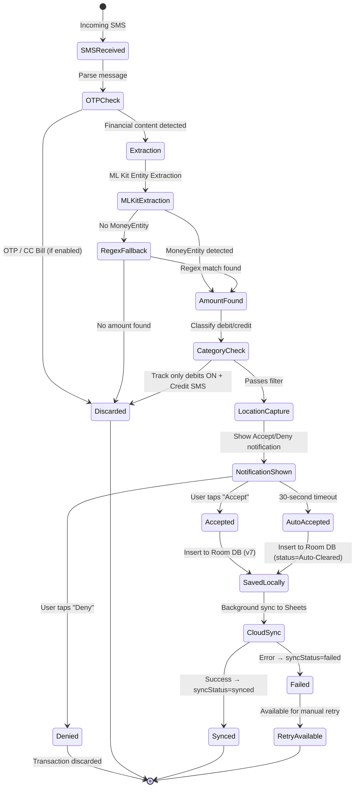
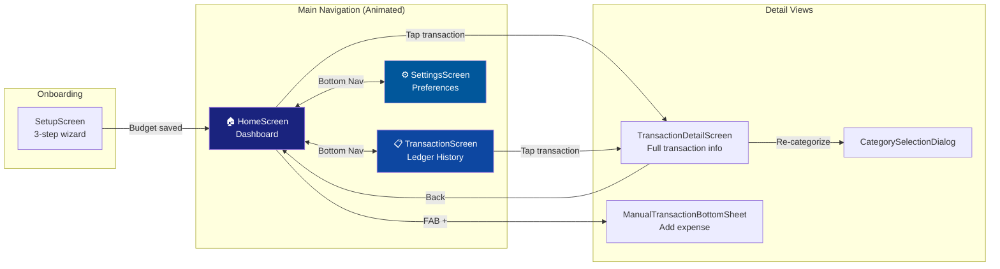

<p align="center">
  
</p>

<h1 align="center">Expense Tracker</h1>

<p align="center">
  <b>AI-Powered Automatic Expense Tracking for Android</b><br/>
  <i>SMS-based transaction detection with ML Kit, real-time notifications, geo-tagged spending, and cloud sync to Google Sheets</i>
</p>

<p align="center">
  
  
  
  
  
  
</p>

---

## Table of Contents

- [Overview](#overview)
- [Key Features](#key-features)
- [Architecture](#architecture)
  - [High-Level Architecture](#high-level-architecture)
  - [Data Flow — SMS to Cloud](#data-flow--sms-to-cloud)
  - [Notification & User Decision Flow](#notification--user-decision-flow)
  - [Directory Structure](#directory-structure)
- [Screens & Navigation](#screens--navigation)
- [Transaction Extraction Pipeline](#transaction-extraction-pipeline)
  - [ML Kit Entity Extraction](#ml-kit-entity-extraction)
  - [Regex Fallback](#regex-fallback)
  - [Category Classification](#category-classification)
- [Cloud Sync — Google Sheets](#cloud-sync--google-sheets)
  - [Sync Architecture](#sync-architecture)
  - [Apps Script Backend](#apps-script-backend)
  - [API Operations](#api-operations)
- [Data Model](#data-model)
- [Getting Started](#getting-started)
  - [Prerequisites](#prerequisites)
  - [Build & Run](#build--run)
  - [Permissions](#permissions)
  - [Setting Up Cloud Sync](#setting-up-cloud-sync)
- [Tech Stack](#tech-stack)

---

## Overview

**Expense Tracker** is a native Android application that **automatically detects financial transactions from incoming SMS messages** using Google ML Kit's Entity Extraction API. When a bank SMS arrives, the app extracts the amount, determines if it's a debit or credit, classifies it into a spending category, captures the user's GPS location, and presents an actionable notification — all in real-time, without any manual input.

Transactions are persisted locally in a Room database and optionally synced to **Google Sheets** via Apps Script for cloud backup, cross-device access, and spreadsheet-based analytics.

The UI is built entirely with **Jetpack Compose** and **Material 3**, featuring a premium financial dashboard with animated navigation, gradient balance cards, and a dark/light theme system.

---

## Key Features

| Feature                           | Description                                                                                                         |
|-----------------------------------|---------------------------------------------------------------------------------------------------------------------|
| 📱 **Automatic SMS Detection**    | BroadcastReceiver intercepts incoming SMS and extracts transactions in real-time                                    |
| 💬 **RCS Bank Intercept**         | NotificationListenerService captures modern RCS bank transactions directly from system notifications                |
| 🤖 **ML Kit Extraction**          | Google ML Kit Entity Extraction identifies monetary amounts; regex fallback                                         |
| 🧩 **Glance App Widget**          | Material 3 widget with real-time updates; auto-refreshes whenever app is backgrounded or minimized                  |
| 🛡️ **Robust Deduplication**      | Hash-based matching with 60s time-windows prevents duplicates even after phone reboots or database rebuilds         |
| 💳 **Ignore CC Bills**            | Smart filter and settings toggle to automatically skip credit card statement and due-date alerts                    |
| 🏷️ **AI Chip Tags**              | Clear visual labeling (MANUAL, AUTOMATED, or AI) to identify the source of each transaction                         |
| 📍 **Geo-Tagged Transactions**    | Captures precise GPS coordinates at time of transaction using Fused Location Provider                               |
| 🔔 **30-Second Accept/Deny**      | Rich notification with Accept/Deny actions; auto-accepts on timeout                                                 |
| ☁️ **Google Sheets Cloud Sync**   | Full CRUD sync via Google Apps Script with debit-normalization during restore and API key auth                      |
| 🧠 **AI Smart Sync (Lazy Sync)**  | On-device AI (Gemma 2B) with few-shot prompting to scan historical SMS for missed transactions while filtering OTPs |
| 💰 **Budget Tracking**            | Monthly budget target with remaining balance displayed on home card                                                 |
| 🌙 **Premium Theme System**       | Follow system theme or manually toggle Premium Dark Mode (deep blacks)                                              |
| 🔄 **Intelligent Navigation**     | Refined back-gesture logic: Detail → Previous Page, History/Settings → Home, Home → Exit                            |
| 🔄 **Offline-First Architecture** | Local Room DB as source of truth (v7); background cloud sync with retry for failed uploads                          |
| 📤 **Transaction Sharing**        | Screenshot capture + text share of transaction details including Google Maps link                                   |

---

## Architecture

### High-Level Architecture



### Data Flow — SMS to Cloud



### Notification & User Decision Flow



### Directory Structure

```
ExpenseTracker/
├── app/
│   ├── build.gradle.kts                    # App-level Gradle config (dependencies, SDK versions)
│   ├── proguard-rules.pro                  # ProGuard/R8 rules
│   └── src/
│       └── main/
│           ├── AndroidManifest.xml          # Permissions, receivers, activity, FileProvider
│           ├── res/                         # Resources (layouts, drawables, strings, themes)
│           └── java/com/myapp/expensetracker/
│               │
│               ├── ── Core ──
│               ├── MainActivity.kt          # Entry point, lifecycle-aware widget updates, navigation
│               ├── Transaction.kt           # Room @Entity — added bodyHash for robust dedup
│               ├── TransactionDao.kt        # Room @Dao — improved duplicate checks
│               ├── AppDatabase.kt           # Room database singleton (version 7)
│               │
│               ├── ── SMS Processing & AI ──
│               ├── SmsReceiver.kt           # BroadcastReceiver — SMS interception + notification
│               ├── SmsMonitorService.kt     # Foreground Service — Keeps app alive for reliable intercepts
│               ├── BootReceiver.kt          # BroadcastReceiver — Auto-starts monitor after device reboot
│               ├── LazySyncManager.kt       # AI-Powered historical SMS analysis (Gemma 2B)
│               ├── TransactionExtractor.kt  # ML Kit + Regex + CC Bill detection pipeline
│               ├── NotificationReceiver.kt  # Handles Accept/Deny/Timeout notification actions
│               │
│               ├── ── Cloud Sync ──
│               ├── GoogleSheetsLogger.kt    # Retrofit-based CRUD client for Apps Script
│               ├── GoogleSheetsApi.kt       # Retrofit API interface + response models
│               │
│               └── ui/
│                   ├── ── Theme ──
│                   ├── theme/
│                   │   └── Theme.kt         # Material 3 color schemes, typography, theme composable
│                   │
│                   ├── ── Screens ──
│                   ├── screens/
│                   │   ├── HomeScreen.kt             # Financial dashboard + balance card + recent list
│                   │   ├── TransactionScreen.kt      # Full transaction history grouped by date
│                   │   ├── TransactionDetailScreen.kt # Detail view + re-categorize + delete + share + map
│                   │   ├── SettingsScreen.kt          # Budget, cloud sync, CC Bill toggle, data management
│                   │   └── SetupScreen.kt             # 3-step onboarding wizard
│                   │
│                   └── ── Components & Widgets ──
│                       ├── components/
│                       │   ├── TransactionListItem.kt        # Reusable row with AI/Manual/Auto chip tags
│                       │   ├── ManualTransactionBottomSheet.kt # Manual expense entry bottom sheet
│                       │   └── CategoryUtils.kt               # Category → icon/color mapping
│                       └── ExpenseWidget.kt                  # Material 3 Glance homescreen widget
...
```

---

## Screens & Navigation



| Screen                      | Description                                                                                                                                                                                  |
|-----------------------------|----------------------------------------------------------------------------------------------------------------------------------------------------------------------------------------------|
| **SetupScreen**             | 3-step onboarding: Welcome → Set monthly budget → Feature highlights                                                                                                                         |
| **HomeScreen**              | Premium gradient balance card, monthly budget tracker, recent activity feed, FAB for manual logging, cloud sync status indicator                                                             |
| **TransactionScreen**       | Full transaction history grouped by date (Today, Yesterday, dated headers) with animated list items                                                                                          |
| **TransactionDetailScreen** | Detailed view with category icon, amount display, date, merchant source, original SMS body, GPS coordinates, Google Maps link, re-categorize, delete, and share actions                      |
| **SettingsScreen**          | Budget planning, Google Sheets cloud sync configuration (with embedded Apps Script code), appearance toggles (dark mode, system theme, debit-only tracking, CC bill filter), data management |

---

## Data Model

### Transaction Entity (Room)

```kotlin
@Entity(tableName = "transactions")
data class Transaction(
    @PrimaryKey(autoGenerate = true) val id: Int = 0,
    val remoteId: String? = null,
    val syncStatus: String = "synced",
    val sender: String,
    val amount: Double,
    val date: Long,
    val body: String,
    val bodyHash: Int = body.hashCode(), // Added for restart-proof deduplication
    val category: String = "Other",
    val status: String = "Cleared",
    val type: String = "automated",      // "automated" | "manual" | "AI"
    val latitude: Double? = null,
    val longitude: Double? = null
)
```

### Database Operations (DAO)

| Operation              | Method                                   | Return                         |
|------------------------|------------------------------------------|--------------------------------|
| Get all transactions   | `getAllTransactions()`                   | `Flow<List<Transaction>>`      |
| Get by ID              | `getTransactionById(id)`                 | `Flow<Transaction?>`           |
| Duplicate Check        | `checkDuplicate(date, amount, bodyHash)` | `Int` (Uses 60s window + hash) |
| Insert/Update          | `insert(transaction)`                    | —                              |
| Insert & get ID        | `insertAndReturnId(transaction)`         | `Long`                         |
| Update sync status     | `updateSyncStatus(id, remoteId, status)` | —                              |
| Delete single          | `delete(transaction)`                    | —                              |
| Delete all             | `deleteAllTransactions()`                | —                              |
| Reset pending → failed | `resetPendingStatus()`                   | —                              |

---
<p align="center">
  <b>Built with ❤️ for effortless financial tracking</b><br/>
  <i>Your spending, captured automatically — one SMS at a time.</i>
</p>
