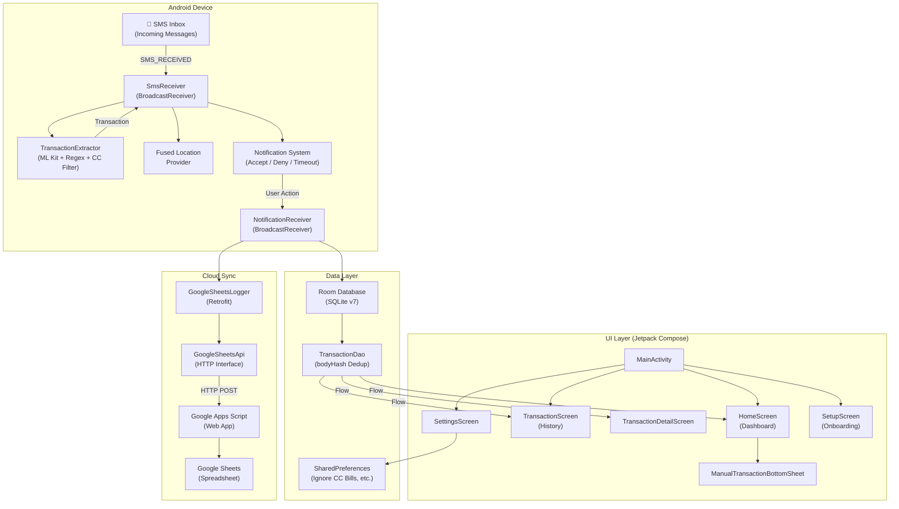
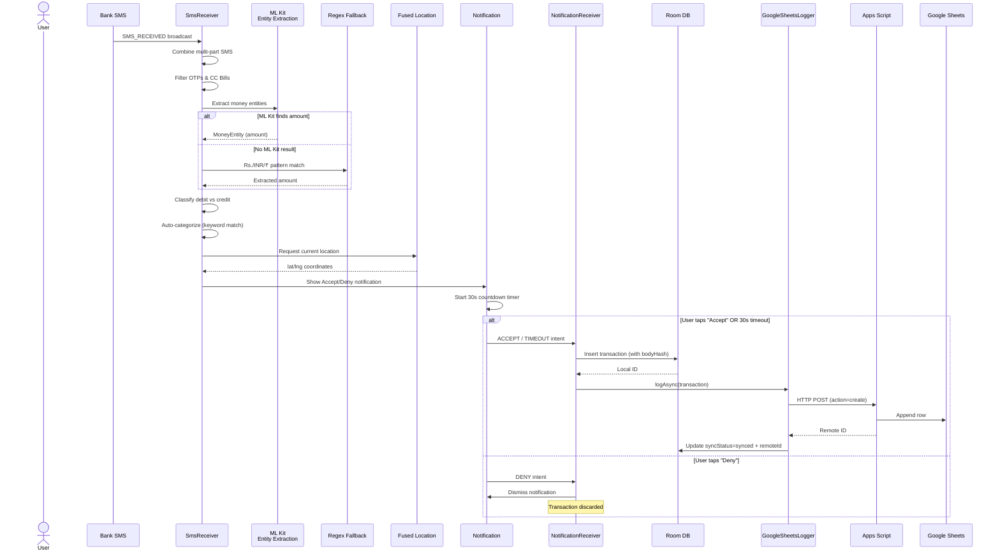
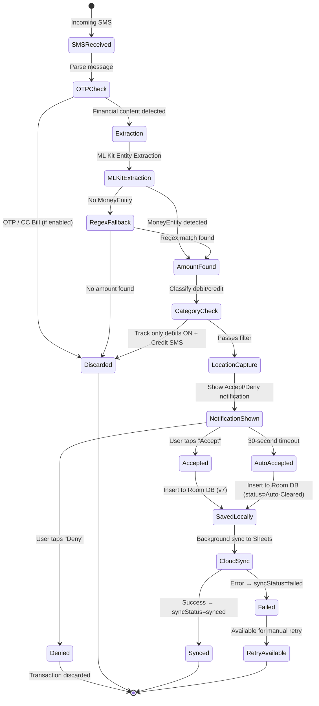
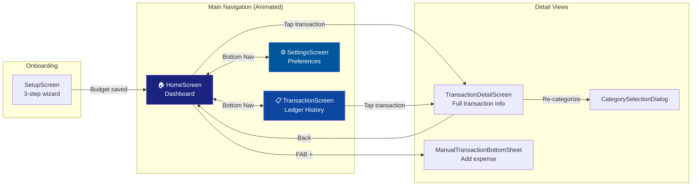

<p align="center">
  
</p>

<h1 align="center">Expense Tracker</h1>

<p align="center">
  <b>AI-Powered Automatic Expense Tracking for Android</b><br/>
  <i>SMS-based transaction detection with ML Kit, real-time notifications, geo-tagged spending, and cloud sync to Google Sheets</i>
</p>

<p align="center">
  
  
  
  
  
  
</p>

---

## Table of Contents

- [Overview](#overview)
- [Key Features](#key-features)
- [Architecture](#architecture)
  - [High-Level Architecture](#high-level-architecture)
  - [Data Flow — SMS to Cloud](#data-flow--sms-to-cloud)
  - [Notification & User Decision Flow](#notification--user-decision-flow)
  - [Directory Structure](#directory-structure)
- [Screens & Navigation](#screens--navigation)
- [Transaction Extraction Pipeline](#transaction-extraction-pipeline)
  - [ML Kit Entity Extraction](#ml-kit-entity-extraction)
  - [Regex Fallback](#regex-fallback)
  - [Category Classification](#category-classification)
- [Cloud Sync — Google Sheets](#cloud-sync--google-sheets)
  - [Sync Architecture](#sync-architecture)
  - [Apps Script Backend](#apps-script-backend)
  - [API Operations](#api-operations)
- [Data Model](#data-model)
- [Getting Started](#getting-started)
  - [Prerequisites](#prerequisites)
  - [Build & Run](#build--run)
  - [Permissions](#permissions)
  - [Setting Up Cloud Sync](#setting-up-cloud-sync)
- [CI/CD & Automated Releases](#cicd--automated-releases)
- [Tech Stack](#tech-stack)

---

## Overview

**Expense Tracker** is a native Android application that **automatically detects financial transactions from incoming SMS messages** using Google ML Kit's Entity Extraction API. When a bank SMS arrives, the app extracts the amount, determines if it's a debit or credit, classifies it into a spending category, captures the user's GPS location, and presents an actionable notification — all in real-time, without any manual input.

Transactions are persisted locally in a Room database and optionally synced to **Google Sheets** via Apps Script for cloud backup, cross-device access, and spreadsheet-based analytics.

The UI is built entirely with **Jetpack Compose** and **Material 3**, featuring a premium financial dashboard with animated navigation, gradient balance cards, and a dark/light theme system.

---

## Key Features

| Feature                           | Description                                                                                                                                                                                       |
|-----------------------------------|---------------------------------------------------------------------------------------------------------------------------------------------------------------------------------------------------|
| 📱 **Automatic SMS Detection**    | BroadcastReceiver intercepts incoming SMS and extracts transactions in real-time                                                                                                                  |
| 💬 **RCS Bank Intercept**         | NotificationListenerService captures modern RCS bank transactions directly from system notifications                                                                                              |
| 🤖 **ML Kit Extraction**          | Google ML Kit Entity Extraction identifies monetary amounts; regex fallback                                                                                                                       |
| 🧩 **Glance App Widget**          | Material 3 widget with real-time updates; auto-refreshes whenever app is backgrounded or minimized; supports monthly budget reset logic                                                           |
| 🛡️ **Robust Deduplication**      | Hash-based matching with 60s time-windows prevents duplicates even after phone reboots or database rebuilds                                                                                       |
| 💳 **Ignore CC Bills**            | Smart filter and settings toggle to automatically skip credit card statement and due-date alerts                                                                                                  |
| 🏷️ **AI Chip Tags**              | Clear visual labeling (MANUAL, AUTOMATED, or AI) to identify the source of each transaction                                                                                                       |
| 📍 **Geo-Tagged Transactions**    | Captures precise GPS coordinates at time of transaction using Fused Location Provider                                                                                                             |
| 🔔 **30-Second Accept/Deny**      | Rich notification with Accept/Deny actions; auto-accepts on timeout                                                                                                                               |
| ☁️ **Google Sheets Cloud Sync**   | Full CRUD sync via Google Apps Script with debit-normalization during restore and API key auth                                                                                                    |
| 🧠 **AI Smart Sync (Lazy Sync)**  | On-device AI (Gemma 2B) with few-shot prompting to scan historical SMS for missed transactions while filtering OTPs                                                                               |
| 🛠️ **AI Model Management**       | Dedicated section to download, repair, or delete the 1.2GB Gemma model with real-time percentage-based progress tracking                                                                          |
| 💰 **Budget Tracking**            | Monthly budget target with remaining balance displayed on home card; auto-reset for monthly mode                                                                                                  |
| 🌙 **Premium Theme System**       | Follow system theme or manually toggle Premium Dark Mode (deep blacks)                                                                                                                            |
| 🔄 **Intelligent Navigation**     | Refined back-gesture logic: Detail → Previous Page, History/Settings → Home, Home → Exit                                                                                                          |
| 🔄 **Offline-First Architecture** | Local Room DB as source of truth (v7); background cloud sync with retry for failed uploads                                                                                                        |
| 📤 **Smart Transaction Sharing**  | Premium receipt format with customization options: Toggle Screenshot, Merchant, Date, Location, and Message                                                                                       |
| 🔁 **Automatic Update Checker**   | Checks GitHub Releases daily at 6 PM IST; detects new tags *and* same-tag re-releases via commit-hash comparison; notifies user and surfaces a one-tap download link in Settings                  |
| 🚀 **Automated Releases**         | GitHub Actions pipeline builds, signs, and publishes split APKs (`arm64-v8a` + `armeabi-v7a`) automatically on tag push; version is derived directly from the tag — no manual code changes needed |

---

## Architecture

### High-Level Architecture


```mermaid
graph TB
    subgraph Android Device
        SMS["📱 SMS Inbox<br/>(Incoming Messages)"]
        RCV["SmsReceiver<br/>(BroadcastReceiver)"]
        EXT["TransactionExtractor<br/>(ML Kit + Regex + CC Filter)"]
        LOC["Fused Location<br/>Provider"]
        NOTIF["Notification System<br/>(Accept / Deny / Timeout)"]
        NRCV["NotificationReceiver<br/>(BroadcastReceiver)"]
    end

    subgraph Data Layer
        DB["Room Database<br/>(SQLite v7)"]
        DAO["TransactionDao<br/>(bodyHash Dedup)"]
        PREFS["SharedPreferences<br/>(Ignore CC Bills, etc.)"]
    end

    subgraph UI Layer ["UI Layer (Jetpack Compose)"]
        MA["MainActivity"]
        HOME["HomeScreen<br/>(Dashboard)"]
        TXN["TransactionScreen<br/>(History)"]
        DETAIL["TransactionDetailScreen"]
        SETTINGS["SettingsScreen"]
        SETUP["SetupScreen<br/>(Onboarding)"]
        MANUAL["ManualTransactionBottomSheet"]
    end

    subgraph Cloud Sync
        LOGGER["GoogleSheetsLogger<br/>(Retrofit)"]
        API["GoogleSheetsApi<br/>(HTTP Interface)"]
        SCRIPT["Google Apps Script<br/>(Web App)"]
        SHEET["Google Sheets<br/>(Spreadsheet)"]
    end

    SMS -->|SMS_RECEIVED| RCV
    RCV --> EXT
    RCV --> LOC
    EXT -->|Transaction| RCV
    RCV --> NOTIF
    NOTIF -->|User Action| NRCV
    NRCV --> DB
    NRCV --> LOGGER
    DB --> DAO
    DAO -->|Flow<List>| HOME
    DAO -->|Flow<List>| TXN
    DAO -->|Flow<Transaction>| DETAIL
    LOGGER --> API
    API -->|HTTP POST| SCRIPT
    SCRIPT --> SHEET
    MA --> HOME
    MA --> TXN
    MA --> SETTINGS
    MA --> SETUP
    HOME --> MANUAL
    SETTINGS --> PREFS
```

### Data Flow — SMS to Cloud


```mermaid
sequenceDiagram
    actor User
    participant SMS as Bank SMS
    participant Receiver as SmsReceiver
    participant MLKit as ML Kit<br/>Entity Extraction
    participant Regex as Regex Fallback
    participant GPS as Fused Location
    participant Notif as Notification
    participant NReceiver as NotificationReceiver
    participant Room as Room DB
    participant Logger as GoogleSheetsLogger
    participant Script as Apps Script
    participant Sheet as Google Sheets

    SMS->>Receiver: SMS_RECEIVED broadcast
    Receiver->>Receiver: Combine multi-part SMS
    Receiver->>Receiver: Filter OTPs & CC Bills

    Receiver->>MLKit: Extract money entities
    alt ML Kit finds amount
        MLKit-->>Receiver: MoneyEntity (amount)
    else No ML Kit result
        Receiver->>Regex: Rs./INR/₹ pattern match
        Regex-->>Receiver: Extracted amount
    end

    Receiver->>Receiver: Classify debit vs credit
    Receiver->>Receiver: Auto-categorize (keyword match)
    Receiver->>GPS: Request current location
    GPS-->>Receiver: lat/lng coordinates

    Receiver->>Notif: Show Accept/Deny notification
    Notif->>Notif: Start 30s countdown timer

    alt User taps "Accept" OR 30s timeout
        Notif->>NReceiver: ACCEPT / TIMEOUT intent
        NReceiver->>Room: Insert transaction (with bodyHash)
        Room-->>NReceiver: Local ID
        NReceiver->>Logger: logAsync(transaction)
        Logger->>Script: HTTP POST (action=create)
        Script->>Sheet: Append row
        Script-->>Logger: Remote ID
        Logger->>Room: Update syncStatus=synced + remoteId
    else User taps "Deny"
        Notif->>NReceiver: DENY intent
        NReceiver->>Notif: Dismiss notification
        Note over NReceiver: Transaction discarded
    end
```

### Notification & User Decision Flow


```mermaid
stateDiagram-v2
    [*] --> SMSReceived: Incoming SMS
    SMSReceived --> OTPCheck: Parse message

    OTPCheck --> Discarded: OTP / CC Bill (if enabled)
    OTPCheck --> Extraction: Financial content detected

    Extraction --> MLKitExtraction: ML Kit Entity Extraction
    MLKitExtraction --> AmountFound: MoneyEntity detected
    MLKitExtraction --> RegexFallback: No MoneyEntity
    RegexFallback --> AmountFound: Regex match found
    RegexFallback --> Discarded: No amount found

    AmountFound --> CategoryCheck: Classify debit/credit
    CategoryCheck --> Discarded: Track only debits ON + Credit SMS
    CategoryCheck --> LocationCapture: Passes filter

    LocationCapture --> NotificationShown: Show Accept/Deny notification

    NotificationShown --> Accepted: User taps "Accept"
    NotificationShown --> Denied: User taps "Deny"
    NotificationShown --> AutoAccepted: 30-second timeout

    Accepted --> SavedLocally: Insert to Room DB (v7)
    AutoAccepted --> SavedLocally: Insert to Room DB (status=Auto-Cleared)

    SavedLocally --> CloudSync: Background sync to Sheets
    CloudSync --> Synced: Success → syncStatus=synced
    CloudSync --> Failed: Error → syncStatus=failed
    Failed --> RetryAvailable: Available for manual retry

    Denied --> [*]: Transaction discarded
    Discarded --> [*]
    Synced --> [*]
    RetryAvailable --> [*]
```

### Directory Structure

```
ExpenseTracker/
├── app/
│   ├── build.gradle.kts                    # App-level Gradle config (dependencies, SDK versions)
│   ├── proguard-rules.pro                  # ProGuard/R8 rules
│   └── src/
│       └── main/
│           ├── AndroidManifest.xml          # Permissions, receivers, activity, FileProvider
│           ├── res/                         # Resources (layouts, drawables, strings, themes)
│           └── java/com/myapp/expensetracker/
│               │
│               ├── ── Core ──
│               ├── ExpenseApplication.kt    # Custom Application class initializing Koin DI
│               ├── MainActivity.kt          # Entry point, lifecycle-aware widget updates, navigation
│               ├── Transaction.kt           # Room @Entity — added bodyHash for robust dedup
│               ├── TransactionDao.kt        # Room @Dao — improved duplicate checks
│               ├── TransactionDedup.kt      # Hash-based cross-layer deduplication logic
│               ├── AppDatabase.kt           # Room database singleton (version 7)
│               │
│               ├── ── SMS Processing & AI ──
│               ├── SmsReceiver.kt           # BroadcastReceiver — SMS interception + notification
│               ├── SmsMonitorService.kt     # Foreground Service — Keeps app alive for reliable intercepts
│               ├── BootReceiver.kt          # BroadcastReceiver — Auto-starts monitor after device reboot
│               ├── LazySyncManager.kt       # AI-Powered historical SMS analysis (Gemma 2B)
│               ├── TransactionExtractor.kt  # ML Kit + Regex + CC Bill detection pipeline
│               ├── NotificationReceiver.kt  # Handles Accept/Deny/Timeout notification actions
│               ├── TransactionNotificationListener.kt # Intercepts RCS/Bank notifications natively
│               │
│               ├── ── Architecture Components ──
│               ├── di/AppModule.kt          # Koin dependency injection module
│               ├── viewmodel/               # ViewModels for Home and Transaction screens
│               ├── worker/
│               │   ├── SheetsSyncWorker.kt  # Background cloud sync
│               │   ├── WidgetUpdateWorker.kt# Triggers homescreen widget refresh
│               │   └── UpdateCheckWorker.kt # Daily 6 PM IST GitHub release checker
│               │
│               ├── ── Cloud Sync & Updates ──
│               ├── GoogleSheetsLogger.kt    # Retrofit-based CRUD client for Apps Script
│               ├── GoogleSheetsApi.kt       # Retrofit API interface + response models
│               ├── GitHubApi.kt             # Retrofit interface for GitHub Releases & Git refs API
│               │
│               └── ui/
│                   ├── ── Theme ──
│                   ├── theme/
│                   │   └── Theme.kt         # Material 3 color schemes, typography, theme composable
│                   │
│                   ├── ── Screens ──
│                   ├── screens/
│                   │   ├── HomeScreen.kt             # Financial dashboard + balance card + recent list
│                   │   ├── TransactionScreen.kt      # Full transaction history grouped by date
│                   │   ├── TransactionDetailScreen.kt # Detail view + re-categorize + delete + share + map
│                   │   ├── SettingsScreen.kt          # Budget, cloud sync, CC Bill toggle, data management
│                   │   └── SetupScreen.kt             # 3-step onboarding wizard
│                   │
│                   └── ── Components & Widgets ──
│                       ├── components/
│                       │   ├── TransactionListItem.kt        # Reusable row with AI/Manual/Auto chip tags
│                       │   ├── ManualTransactionBottomSheet.kt # Manual expense entry bottom sheet
│                       │   └── CategoryUtils.kt               # Category → icon/color mapping
│                       └── ExpenseWidget.kt                  # Material 3 Glance homescreen widget
...
```

---

## Screens & Navigation


```mermaid
graph LR
    subgraph Onboarding
        SETUP["SetupScreen<br/>3-step wizard"]
    end

    subgraph Main Nav ["Main Navigation (Animated)"]
        HOME["🏠 HomeScreen<br/>Dashboard"]
        HISTORY["📋 TransactionScreen<br/>Ledger History"]
        SETTINGS["⚙️ SettingsScreen<br/>Preferences"]
    end

    subgraph Detail ["Detail Views"]
        DETAIL["TransactionDetailScreen<br/>Full transaction info"]
        MANUAL["ManualTransactionBottomSheet<br/>Add expense"]
        CAT_DIALOG["CategorySelectionDialog"]
    end

    SETUP -->|Budget saved| HOME
    HOME <-->|"Bottom Nav"| HISTORY
    HOME <-->|"Bottom Nav"| SETTINGS
    HOME -->|Tap transaction| DETAIL
    HOME -->|FAB +| MANUAL
    HISTORY -->|Tap transaction| DETAIL
    DETAIL -->|Re-categorize| CAT_DIALOG
    DETAIL -->|Back| HOME

    style HOME fill:#1A237E,color:#fff
    style HISTORY fill:#0D47A1,color:#fff
    style SETTINGS fill:#01579B,color:#fff
```

| Screen                      | Description                                                                                                                                                                                                                                             |
|-----------------------------|---------------------------------------------------------------------------------------------------------------------------------------------------------------------------------------------------------------------------------------------------------|
| **SetupScreen**             | 3-step onboarding: Welcome → Set monthly budget → Feature highlights                                                                                                                                                                                    |
| **HomeScreen**              | Premium gradient balance card, monthly budget tracker, recent activity feed, FAB for manual logging, cloud sync status indicator                                                                                                                        |
| **TransactionScreen**       | Full transaction history grouped by date (Today, Yesterday, dated headers) with animated list items                                                                                                                                                     |
| **TransactionDetailScreen** | Detailed view with category icon, amount display, date, merchant source, original SMS body, GPS coordinates, Google Maps link, re-categorize, delete, and share actions (with selective content toggles)                                                |
| **SettingsScreen**          | Budget planning, AI & Intelligence (model management, lazy sync), Google Sheets cloud sync configuration (with embedded Apps Script code), appearance toggles, data management, **Updates section** (check now button, update status, one-tap download) |

---

## Data Model

### Transaction Entity (Room)

```kotlin
@Entity(tableName = "transactions")
data class Transaction(
    @PrimaryKey(autoGenerate = true) val id: Int = 0,
    val remoteId: String? = null,
    val syncStatus: String = "synced",
    val sender: String,
    val amount: Double,
    val date: Long,
    val body: String,
    val bodyHash: Int = body.hashCode(), // Added for restart-proof deduplication
    val category: String = "Other",
    val status: String = "Cleared",
    val type: String = "automated",      // "automated" | "manual" | "AI"
    val latitude: Double? = null,
    val longitude: Double? = null
)
```

### Database Operations (DAO)

| Operation              | Method                                   | Return                         |
|------------------------|------------------------------------------|--------------------------------|
| Get all transactions   | `getAllTransactions()`                   | `Flow<List<Transaction>>`      |
| Get by ID              | `getTransactionById(id)`                 | `Flow<Transaction?>`           |
| Duplicate Check        | `checkDuplicate(date, amount, bodyHash)` | `Int` (Uses 60s window + hash) |
| Insert/Update          | `insert(transaction)`                    | —                              |
| Insert & get ID        | `insertAndReturnId(transaction)`         | `Long`                         |
| Update sync status     | `updateSyncStatus(id, remoteId, status)` | —                              |
| Delete single          | `delete(transaction)`                    | —                              |
| Delete all             | `deleteAllTransactions()`                | —                              |
| Reset pending → failed | `resetPendingStatus()`                   | —                              |

---

## CI/CD & Automated Releases

This project uses **GitHub Actions** (`.github/workflows/release.yml`) to automate the entire build
and release process.

### How it works

When a tag is pushed (e.g., `v2.3.0`), the pipeline:

1. Provisions an Ubuntu runner with JDK 17.
2. Decodes your securely stored Base64 keystore from GitHub Secrets.
3. **Extracts the version automatically from the tag** — no manual version bumps in code ever
   needed.
4. Builds and signs split APKs (`arm64-v8a` and `armeabi-v7a`) via Gradle.
5. Publishes a new **GitHub Release** with both APKs attached and auto-generated release notes.

### Automatic version injection

The tag name is stripped of its `v` prefix and passed to Gradle as the `APP_VERSION` environment
variable:

```bash
# In the workflow:
VERSION="${GITHUB_REF#refs/tags/v}"   # "v2.3.0" → "2.3.0"
```

Gradle picks this up in `app/build.gradle.kts`:

```kotlin
// CI: uses APP_VERSION env var from the tag
// Local: falls back to libs.versions.toml — Studio builds are unaffected
val resolvedVersionName = System.getenv("APP_VERSION")?.takeIf { it.isNotBlank() }
    ?: libs.versions.appVersion.get()

// versionCode auto-derived from semver: "2.3.1" → 20301
val resolvedVersionCode = major * 10000 + minor * 100 + patch
```

| Context                | `VERSION_NAME` source             | `VERSION_CODE` source     |
|------------------------|-----------------------------------|---------------------------|
| CI (tag push)          | Git tag via `APP_VERSION` env var | Auto-computed from semver |
| Local (Android Studio) | `libs.versions.toml`              | `libs.versions.toml`      |

### Triggering a release

```bash
# New version
git tag v2.3.0
git push origin v2.3.0

# Re-release same version with a different commit (patch)
git tag -f v2.3.0
git push origin v2.3.0 --force
```

> **Required GitHub Secrets:** `KEYSTORE_BASE64`, `KEYSTORE_PASSWORD`, `KEY_ALIAS`, `KEY_PASSWORD`

---

## Automatic Update Checker

The app silently checks for updates in the background and notifies users when a new release is
available.

### How it detects updates

1. **New tag** — if the latest GitHub release tag differs from `BuildConfig.VERSION_NAME`, it's an
   update.
2. **Same tag, new commit** — if the tag is identical but the underlying commit hash differs (i.e.,
   a forced re-release), it's still an update. This uses a two-step GitHub Git refs API call to
   correctly resolve both lightweight *and* annotated tags:
    - `GET /repos/.../git/ref/tags/{tag}` → get ref object
    - If `object.type == "tag"` (annotated) → `GET /repos/.../git/tags/{sha}` to peel to the commit
      SHA
    - Compare peeled commit SHA against the `GIT_COMMIT_HASH` baked into the APK at build time

### Schedule & behavior

| Trigger                          | Behavior                                                                          |
|----------------------------------|-----------------------------------------------------------------------------------|
| **Daily at 6 PM IST**            | Automatic background check via WorkManager `OneTimeWorkRequest` chained to itself |
| **Settings → Updates → Refresh** | On-demand manual check                                                            |
| **Update found**                 | System notification + "Download Update" button enabled in Settings                |
| **No update**                    | Notification suppressed, "Download Update" button remains grayed out              |
| **Download Update**              | Opens the GitHub Releases page in the browser                                     |

### Key implementation files

| File                          | Role                                                                                                            |
|-------------------------------|-----------------------------------------------------------------------------------------------------------------|
| `worker/UpdateCheckWorker.kt` | WorkManager worker — fetches release info, resolves commit SHA, writes to SharedPreferences, fires notification |
| `GitHubApi.kt`                | Retrofit interface for `GET /releases/latest`, `GET /git/ref/tags/{tag}`, `GET /git/tags/{sha}`                 |
| `SettingsScreen.kt`           | Reads `update_available` from SharedPreferences via a live listener; enables/disables the Download button       |

---
<p align="center">
  <b>Built with ❤️ for effortless financial tracking</b><br/>
  <i>Your spending, captured automatically — one SMS at a time.</i>
</p>
